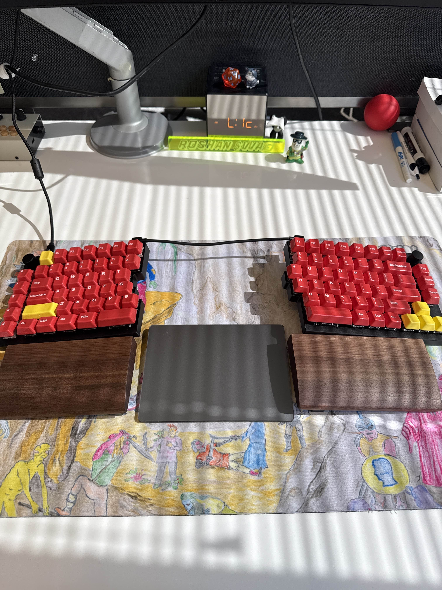
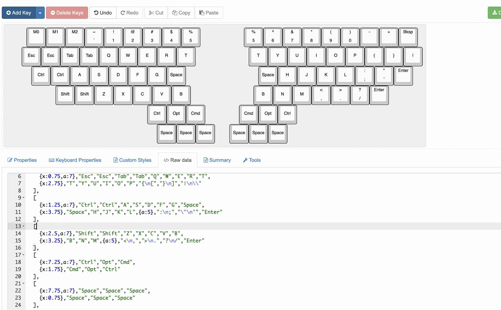
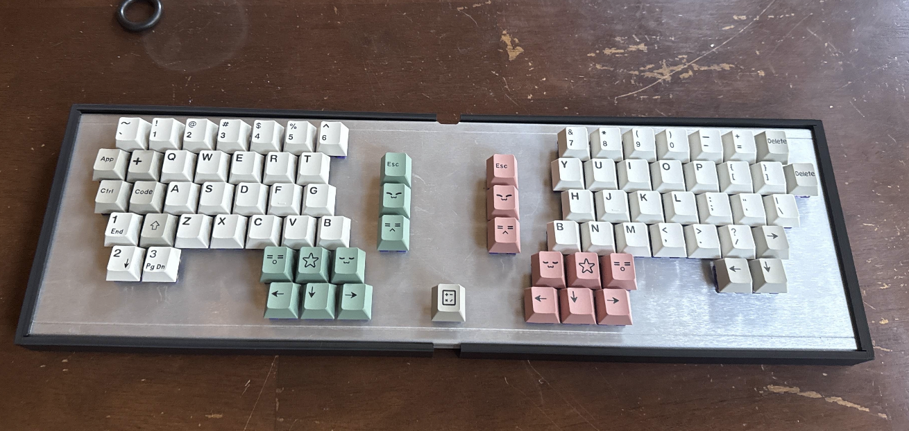

In September, my friend [Tristan](https://khedron.net/) said he was designing a keyboard. He had spoken to our mutual friend [Dede](https://github.com/dededecline) who has created many keyboards (see https://github.com/dededecline/SST60) and found out that it was a lot simpler than he (and I) previously thought it was.

Clowing on each other is the core of our friendship, so, I decided to make one too. *This was probably a bad idea.*

**Disclaimer:** I am not an expert in keyboard design, ergonomics, PCB design, CAD, or firmware. I got a C in my high school physics class. I write `yaml` for a living. So take every fact I state here with a grain of salt.

Here's some example code:

```text
keyboard:
  name: "My First Keyboard"
  layout: qwerty
  split: true
```

## The beginning of the end (layouts)
**Background knowledge**:

- Ergonomic keyboards are a relatively overloaded term, but in this piece I use the term to mean any keyboard that is designed to be relatively ergonomic compared to more traditional designs. What I characterize as "less extreme" ergonomic keyboards are ones like those Microsoft ergo keyboards that have some level of sloping, or a split keyboard I have below which is a normal keyboard chopped in half. "More extreme" would be something like an ortholinear, column staggered keyboard which fundamentally moves the placement of keys compared to the staggered design most of us are used to.
- I just use QWERTY as layout, I'm not yet interested in moving to DVORAK or COLEMAK.

**Resources**:

- [Keyboard Layout Editor](http://www.keyboard-layout-editor.com/) (layout generator for more normal keyboards)
- [Ergogen](https://ergogen.xyz/) (layout generator + PCB generator geared towards more ergonomic keyboards)
---

I started with trying to generate a layout that was more tuned to me. I knew I wanted something somewhat split (i.e., like an Alice layout) as I've had been using a more traditional, staggered split keyboard for a while because of wrist pain. My workflow on my dev machines have been clustered around "leader" keys with various vim-like navigation keybindings, so I wanted keys I typically strain to hit (Command/Win, Alt, and Space) to be more easily accessible.



To design this I had two options — Keyboard Layout Editor (KLE) and Ergogen. I ended up going with KLE as it was pretty straightforward to use in comparison — KLE just took a 2D JSON array of key placements, whereas Ergogen seemed a lot more powerful but more geared towards what I considered at the time to be more extreme ergonomic keyboards, which typically are typically literally split (like my Keychron), which have some design considerations and additional complexity I'll get into later. It's worth it to note that you don't have to commit to that with Ergogen — I found out later that you can have a unibody keyboard just as easily, but you'll find out throughout this piece that I make a lot of assumptions that backfired on me.



Here's an insane early design I considered using. Not ergonomic! Would hurt my hands!

I ended up trying to copy staggered keyboard layout somewhat for key placements after realizing trying to reinvent the wheel in terms of core key placements was a ridiculous idea. So I decided on the following design, which was nearly still as ridiculous.


I also made an insane assumption that it would make sense to use a bunch of 1U (your typical square key's size) keys in lieu of larger ones for "simplicity" to avoid needing to purchase/install stabilizers for things like shift, space, etc.

With the benefit of hindsight: I should have copied a more traditional split layout with some minor tweaks. The 1U hack didn't end up being a hack and ended up just being confusing. That being said, this was probably the most fun aspect of the build. I spent hours trying new layouts and messing with things that looked cool and sending ideas back and forth with Tristan.

## The middle bit(?) of the end (PCB design)
**Background knowledge**:

- Most keyboards are wired pretty simply — each key's switch has a uniquely assigned row and column combination, which corresponds to two pins on the microcontroller, which means you can write your firmware code to watch for that specific combination and output a character.
- I didn't realize I needed a ground pour, but fortunately I messed up my order from JCLPCB (with a separate issue), so they cancelled and sent me a message, letting me fix some other issues I introduced.

**Resources**:

- [https://www.kicad.org/](https://www.kicad.org/) (Free PCB CAD utility)
- [https://keyboard-tools.xyz/](https://keyboard-tools.xyz/) (KLE → Kicad project converter)
- [https://www.raspberrypi.com/products/raspberry-pi-pico/](https://www.raspberrypi.com/products/raspberry-pi-pico/) (The microcontroller used for this build)
---
### Handwiring or PCB?

I chose to go with a PCB because I wanted to learn how to do it, and I had heard it was a lot cleaner than handwiring. I also had heard that handwiring was a pain in the ass, so I wanted to avoid that.


Here's the final PCB design!


And here's what the traces look like

I sent the design off to JCLPCB and got the boards back a week later.

## The end bit (Assembly)
**Background knowledge**:

- [Plate mount](https://docs.splitkb.com/hardware/plate-mount-vs-tray-mount) builds are builds where the switches are mounted to a plate that sits between the PCB and the keycaps. This is different from [tray mount](https://docs.splitkb.com/hardware/plate-mount-vs-tray-mount) where switches clip directly into the PCB.
- [FR4](https://keebtalk.com/t/fr4-material-guide) is a type of material that's commonly used for keyboard plates. It's a glass-reinforced epoxy laminate that's known for being durable and having good acoustic properties.

**Resources**:

- [https://docs.splitkb.com/](https://docs.splitkb.com/) (Great documentation for split keyboard building)
---

I got the PCBs back and started soldering. I had never soldered before, so this was a new experience for me.


Here's the case I designed

I also got some FR4 plates cut (these sit between the PCB and keycaps):


FR4 plates

The assembly process was pretty straightforward:

1. Solder diodes to the PCB
2. Solder switches to the PCB
3. Install plate mount stabilizers (for spacebar and shift keys)
4. Mount PCB to case
5. Install FR4 plate
6. Install keycaps



The final build!


Another angle of the final build


Close up of the keycaps


Typing test


And another one

## Final thoughts

Overall, I'm pretty happy with how this turned out. The keyboard is comfortable to type on, and I learned a ton about PCB design, soldering, and keyboard assembly in general. The 1U space keys are definitely weird, but they work fine for typing.

Would I do this again? Probably not with 12 space keys, but I would definitely build another keyboard. The experience was valuable, and I now have a much better appreciation for people who design keyboards for a living.

If you're thinking about building a keyboard, I'd highly recommend it. It's a fun project that teaches you a lot about electronics, mechanical design, and fabrication. Just don't make the same mistakes I did!